# Peridot (Correspondence Visualizer)

<p align="center">
  
</p>

## Executive Summary

Peridot is an open, research-oriented web application for exploring humanistic data through maps, networks, timelines, charts, advanced search, exports, and evidence dossiers. Its mature first use case is correspondence data based on the creator's dissertation research, but its role-based import workflow also supports point/site data, chart-first time series, and generic evidence records that do not require person-to-person relationships. 

Peridot was created by Haley Price in direct and continuous collaboration with ChatGPT. There is a robust AI disclosure and discussion of AI ethics (and ethical concerns) on the tool's "Learn More About Peridot" page where credit is documented. Please go there for more details. For the purposes of README, it bears mentioning that the reason the documentation is so meticulous (and so robotic) is because Price made ChatGPT record every single decision, commit, redirection, success, and failure throughout Peridot's development so that the full record of labor would be documented and disclosed. This paragraph was written by Price (hi!) but the remnainder of the documentation was written by ChatGPT under exacting human direction and quality assurance supervision. 

This README is the public orientation and workflow guide. It explains what Peridot is, what kinds of work and data it supports, how to run it locally, and how to use the active interface. For current architecture, module ownership, regression contracts, and project-maintenance guidance, use the [Maintainer’s Guide](MAINTAINERS_GUIDE.md), [Project Workflow Charter](PROJECT_WORKFLOW_CHARTER.md), and [Changelog](CHANGELOG.md).

## Quick Navigation

- [What Peridot is](#1-what-peridot-is)
- [Audience, research uses, and supported data](#2-audience-research-uses-and-supported-data)
- [Current public workflow](#3-current-public-workflow)
- [Current interface examples](#4-current-interface-examples)
- [Historical interface archive](#5-historical-interface-archive)
- [Install and run locally](#6-install-and-run-locally)
- [Data-input guide](#7-data-input-guide)
- [Known user-facing limitations](#8-known-user-facing-limitations)
- [Documentation and project references](#9-documentation-and-project-references)
- [Author, license, and attribution](#10-author-license-and-attribution)

## Document Role and Boundaries

This document owns public orientation, user-facing workflows, installation, data-input guidance, screenshots, concise limitations, and attribution. It does not own exhaustive module descriptions, detailed regression matrices, workflow governance, or complete historical chronology.

Current synchronized checkpoint:

```text
a9b9c81 — Add core documentation restructuring plan
Branch: main
Status: local and origin/main aligned after the latest sync ritual
```

For detailed milestone interpretation and full commit history, see [CHANGELOG.md](CHANGELOG.md).


## 1. What Peridot Is

Peridot is the current app identity for the **Correspondence Visualizer** repository. It derives only the structures that mapped data can safely support, then gives researchers an interactive workspace for visualizing, searching, inspecting, and exporting that evidence.

The active interface is workspace-first rather than rail-first. It opens to a concise Home workspace, uses a hamburger menu for public navigation, keeps Timeline inside Visualizations, and uses a dual-mode Inspector: compact side-panel summaries for visual clicks and a full dossier workspace for deeper evidence navigation.

## 2. Audience, Research Uses, and Supported Data

Peridot is designed for researchers working with humanistic records that may be incomplete, heterogeneous, or only partly mappable. It is intended to help users explore patterns without silently standardizing their data or treating visualization readiness as the sole measure of research value.

### Supported research uses

- Place and route mapping when geographic fields are available.
- Entity/person network and force-directed exploration when source-target relationships are mapped.
- Chart-based analysis of dates, categories, numeric measures, relationships, and selected evidence fields.
- Advanced Search across loaded data, with explicit draft-and-apply filtering.
- Evidence inspection through people/entities, places, clusters, routes, and connected records.
- Presentation-ready SVG, PNG, and CSV export.

### Supported data forms

- Peridot template CSV files.
- Arbitrary CSV and TSV tables mapped through explicit field roles.
- XLSX and XLS workbooks, including multi-sheet joins configured by unique ID.
- Point/site datasets with one location per record.
- Relationship/route datasets with source and target entities or locations.
- Chart-first and generic evidence records that may not support mapping or networks.

Peridot follows a **database-first** model: a record may remain useful for search, inspection, evidence preservation, or charts even if it lacks coordinates, a parseable date, or relationship fields.

## 3. Current Public Workflow

### 3.1 Start

The app opens to Home. Use **Use sample data** to move directly into Visualizations with bundled sample material, or **Upload your data** to begin in Manage Your Data.

### 3.2 Load and map data

Manage Your Data provides template download, a unified CSV / TSV / XLSX / XLS upload path, staged file/workbook review, and role-based mapping. The mapping workflow is organized around Preview, Sheets when relevant, Time, Places, Relations, Evidence, and Review.

Users explicitly choose mappings; Peridot does not silently normalize names, places, dates, or controlled vocabularies. Workbook imports use user-configured unique-ID joins rather than row-order matching.

### 3.3 Visualize

Visualize Your Data provides capability-aware access to Place Map, People Network, Force-Directed Network, and Chart Visualizations. Unsupported views should explain why they are not available for the active dataset rather than presenting an empty surface.

Timeline is a compact bottom scrubber within Visualizations. Export is a shared header menu rather than a separate workspace. Map PNG export defaults to an unbranded map-only image, with optional title and metadata annotations.

### 3.4 Explore and inspect

Explore Your Data opens Advanced Search, organized around **Build Search**, **Browse**, **Results**, **Refine / Inspect**, and **Capabilities**. Search uses an explicit draft/apply model: entering text or selecting a suggestion changes draft criteria until **Apply Filters** is pressed.

The Inspector opens compactly after visualization node, edge, or cluster clicks. **Expand**, linked data, and deeper record navigation open the full evidence-dossier workspace while preserving the underlying visualization or Explore state.

### 3.5 Export

The Visualizations header provides SVG and PNG export for map/network views, CSV export for nodes and edges/routes, and PNG export for charts. Export descriptions should make clear whether they represent loaded, filtered, visible, selected, or charted data.

### 3.6 Send feedback

A persistent in-app feedback control is available beneath the hamburger menu. It supports questions, bug reports, issue reports, feature suggestions, and other feedback, with optional context and email fields. The form submits through the project’s Formspree integration.

## 4. Current Interface Examples

### Current interface examples — 2026-06-21

The screenshots in this section document the active workspace-first Peridot interface as captured on **2026-06-21**. They illustrate current public navigation, data-entry, visualization, search, Inspector, Learn More, and feedback workflows. The examples use Peridot’s then-current visual system and representative data states; later feature or design refinements may change details without invalidating the underlying workflow descriptions.

#### Start and navigate


*Home / welcome workspace, 2026-06-21: a concise entry point with sample-data and upload calls to action.*

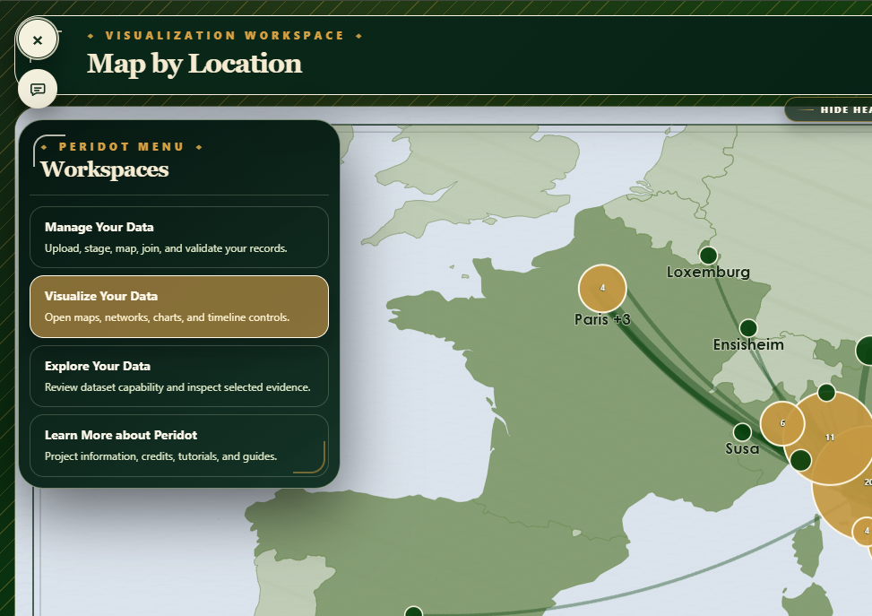

*Public workspace navigation, 2026-06-21: the hamburger menu provides access to Data, Visualizations, Explore, and Learn More.*

#### Load and map data

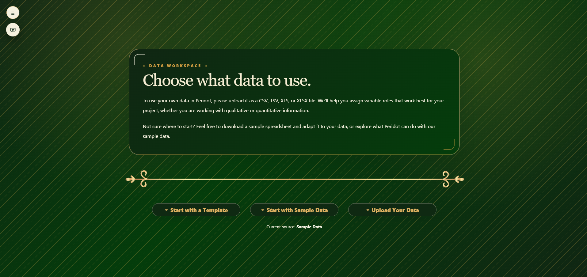

*Data workspace, 2026-06-21: the unified entry point for templates, sample data, and table or workbook upload.*

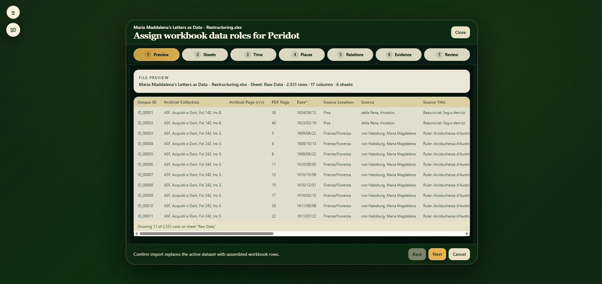

*Workbook role-mapping preview, 2026-06-21: users review a selected sheet before assigning time, place, relationship, evidence, and other data roles.*

#### Visualize and export

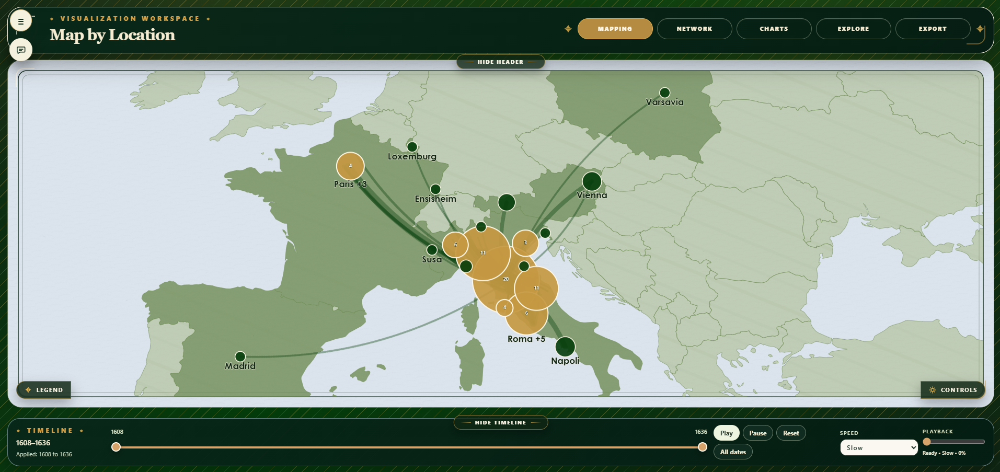

*Place Map workspace, 2026-06-21: geographic nodes, clustered places, routes, map controls, and the integrated timeline scrubber.*

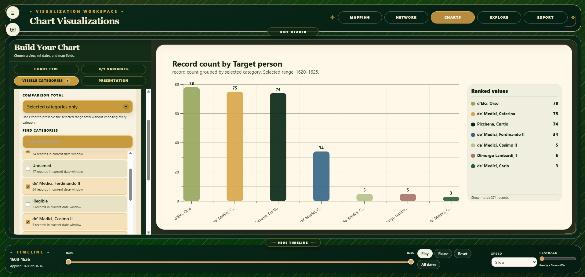

*Chart Visualizations workspace, 2026-06-21: a left-side chart builder pairs with a large chart canvas and ranked-value summary.*

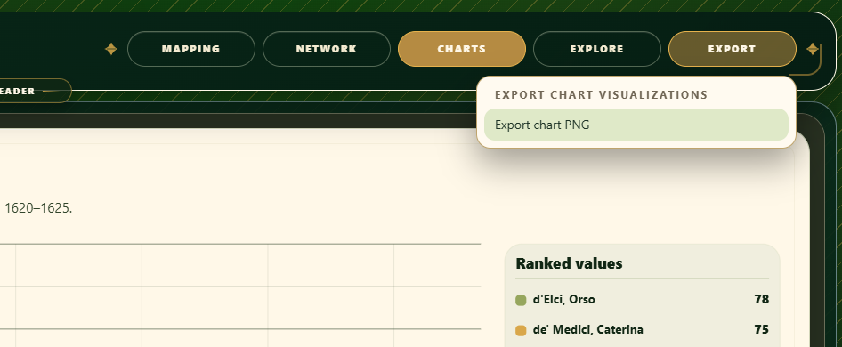

*Chart export control, 2026-06-21: Chart PNG export is available through the shared Visualizations header rather than a separate Export workspace.*

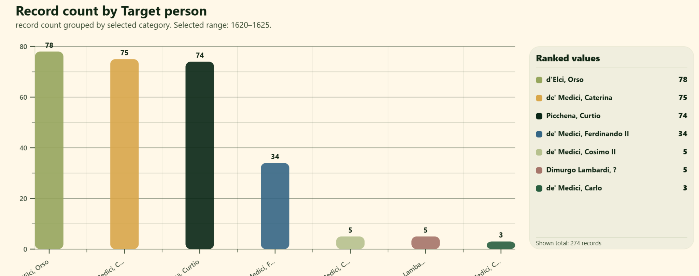

*Example chart PNG output, 2026-06-21: a researcher-facing bar chart with title, selected date range, labeled values, and ranked-value summary.*

<details>
<summary><strong>Additional Analytics examples — 2026-06-21</strong></summary>

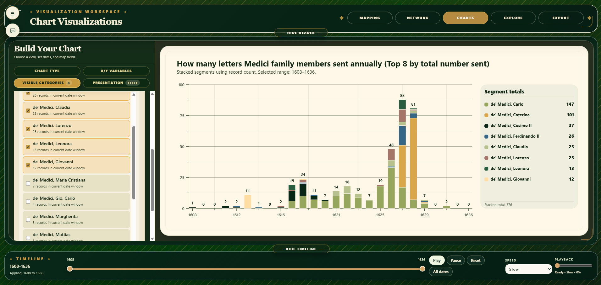

*Stacked bar chart example: annual correspondence volume segmented by selected categories.*

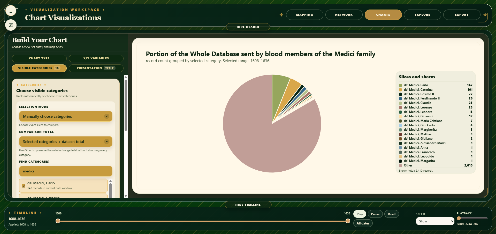

*Pie chart example: selected categories compared with the wider dataset total.*

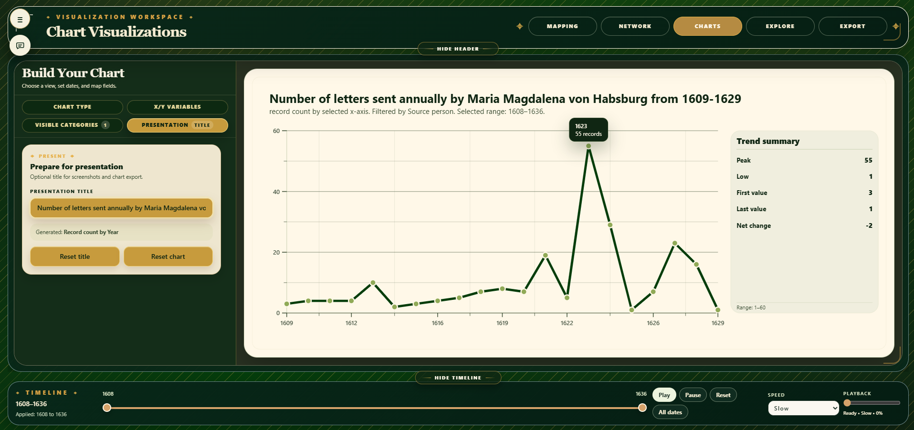

*Line chart example: a selected person’s annual correspondence trend over a defined historical period.*

</details>

#### Explore data

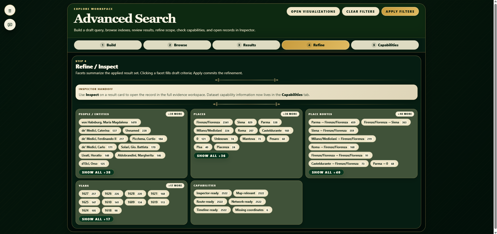

*Advanced Search Refine / Inspect tab, 2026-06-21: applied-result facets make people, places, routes, years, and capabilities available for further scoped refinement.*

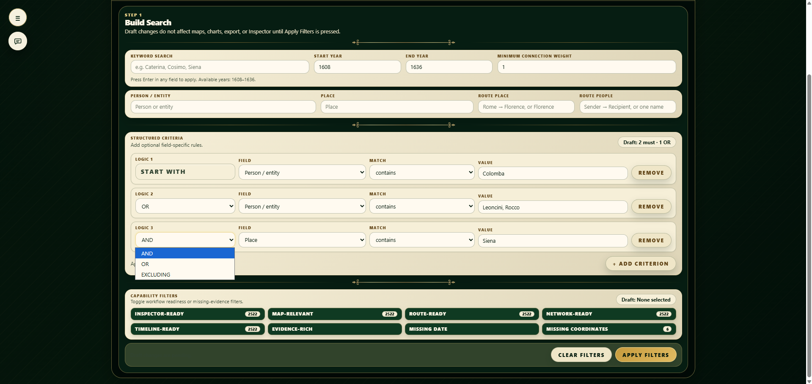

*Advanced Search structured criteria, 2026-06-21: up to five conditions can be combined through explicit AND, OR, and EXCLUDING connectors.*

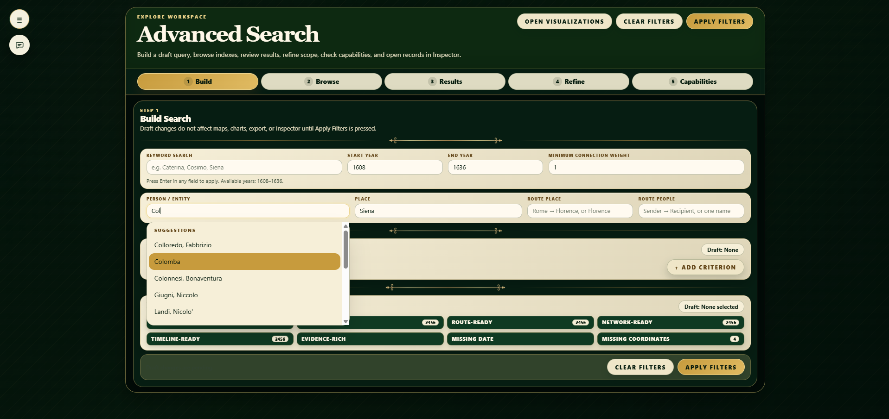

*Advanced Search predictive suggestions, 2026-06-21: person/entity fields provide a constrained, scrollable suggestion list rather than a long static dropdown.*

#### Inspect evidence

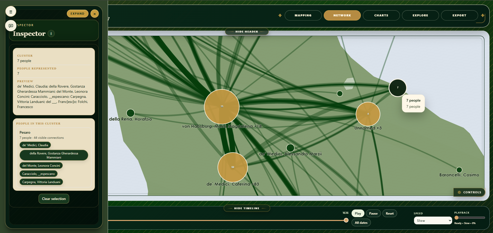

*Compact Inspector over Place Map, 2026-06-21: a selected geographic cluster summarizes represented people and exposes cluster members in context.*

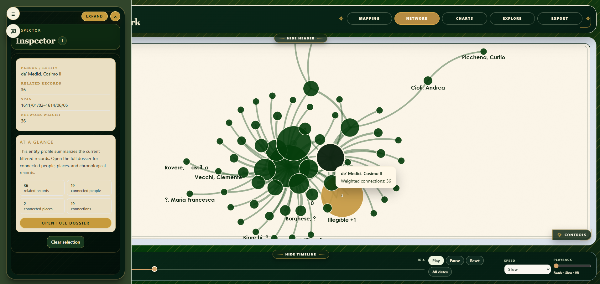

*Compact Inspector over Force-Directed Network, 2026-06-21: a selected person/entity retains network context while exposing connected-record and dossier actions.*

#### Learn and contribute


*Learn More information hub, 2026-06-21: creator context, open-source documentation links, AI-method disclosures, and future tutorial space.*

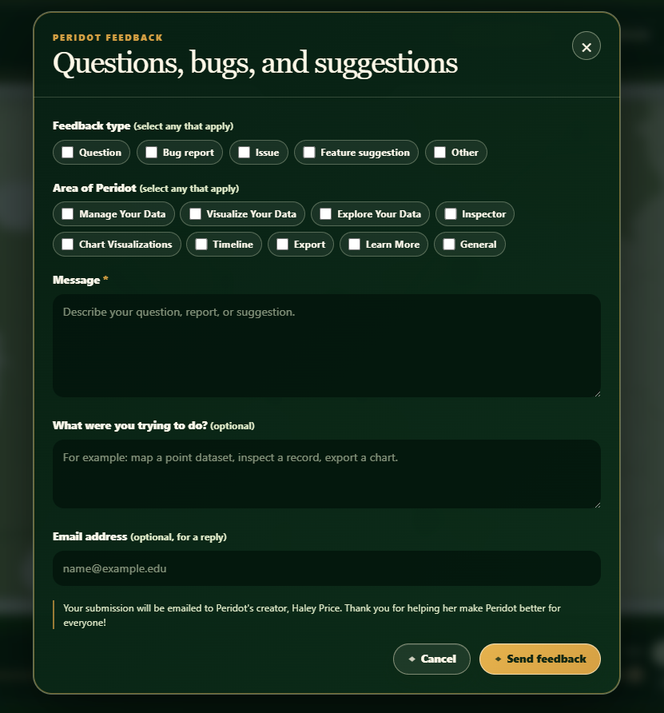

*Persistent in-app feedback form, 2026-06-21: users can submit questions, bug reports, issues, and feature suggestions directly to the project creator.*

### Brand and design-reference assets


*Peridot gilded logo asset used by the current Home workspace.*


*Transparent Peridot logo asset retained for adaptable placements.*

<details>
<summary><strong>Earlier Home layout design references — June 2026</strong></summary>


*Earlier Home layout concept used during the fixed-ratio title-card design process.*


*Annotated earlier Home layout concept documenting design decisions during development.*


*Licensed Adobe Stock filigree selected for current Home framing.*


*Licensed filigree reference set retained for design history and future ornamental work.*

</details>


---

## 5. Historical Interface Archive

The screenshots below document earlier Peridot interface states. They are retained as development records, including the earlier rail/side-panel-first workflow. They are **not** instructions for the active workspace-first navigation model.

<details>
<summary><strong>Open earlier interface records</strong></summary>

#### Earlier geographic view overview


*Earlier geographic-view interface, retained as a pre-workspace-first development record.*

#### Earlier person view overview

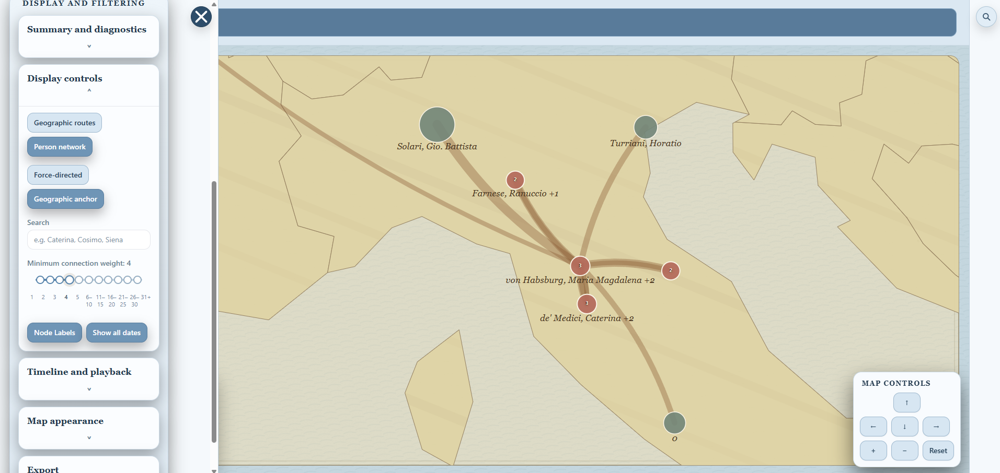

*Earlier person-view interface, retained to document the project’s prior person-network presentation.*

#### Earlier timeline and playback controls


*Earlier standalone timeline/playback presentation, retained from before the current integrated Visualizations scrubber.*

#### Earlier Inspector detail view


*Earlier Inspector presentation, retained from before the current compact-side-panel/full-dossier dual-mode model.*

#### Earlier geographic Inspector example

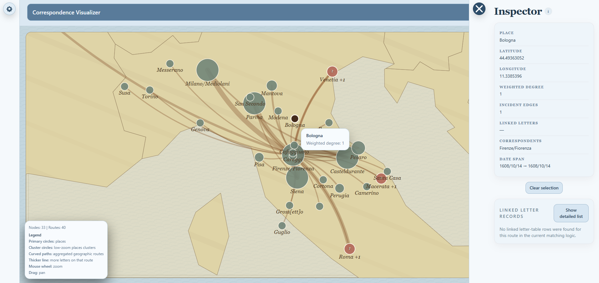

*Earlier geographic Inspector state, retained as a record of pre-dossier map interaction design.*

#### Earlier control panel overview


*Earlier persistent control-panel layout, retained from before the current workspace-first navigation and chart-builder model.*

#### Earlier additional control-panel state


*Earlier control-panel variation, retained to document incremental interface development.*

#### Earlier modern-theme examples

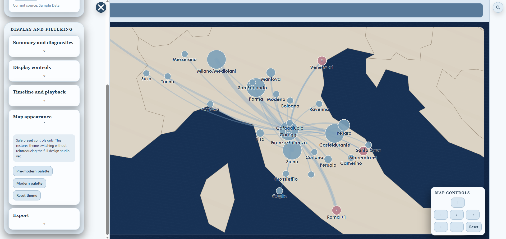

*Earlier Modern theme example, retained as a color-system development record rather than a current public-interface example.*


*Earlier Modern theme example, retained as a companion color-system development record.*

</details>


## 6. Install and Run Locally


### Prerequisites

You should have a recent version of:

- **Node.js**
- **npm**

### Install dependencies

```bash
npm install
```

### Start the development server

```bash
npm run dev
```

### Build for production

```bash
npm run build
```

### Preview the production build

```bash
npm run preview
```

### Repository location

```text
https://github.com/haleyrp1803/peridot-humanistic-data
```

---

### Technology overview

Peridot currently uses React 18, Vite, Tailwind CSS, D3 (`d3-geo` and `d3-force`), `topojson-client`, `world-atlas`, and SheetJS / `xlsx`. Active `main` uses an SVG-based map stage. MapLibre is not an active dependency of `main`; its later migrated-overlay work is archived rather than part of the current application direction.

## 7. Data-Input Guide


Peridot now treats uploaded data through a standardized one-file CSV template, arbitrary CSV/TSV mapping, workbook-aware Excel mapping/import, and a broader role-based capability model.

The Data workspace provides:

- **Download CSV template**
- unified **Upload table or workbook** control for CSV / TSV / XLSX / XLS
- staged table/workbook summary
- column/workbook mapping launch
- post-upload validation popup
- persistent **Latest upload summary** card
- concise data tips

For the standardized correspondence template, each row should represent one letter, document, or correspondence record. For mapped arbitrary tables and workbooks, rows may also represent sites, events, observations, measurements, catalogue entries, or other humanistic records. The public template columns are:

```text
Archive
Collection
Page(s)
Date
Source_Name
Source_Title
Source_Location
Source_Latitude
Source_Longitude
Target_Name
Target_Title
Target_Location
Target_Latitude
Target_Longitude
Relationship
Topic
Language
Transcription
Notes
Link(s)
```

Peridot uses a permissive database-first model. A row can be accepted if it has any of the following:

- `Source_Name` and `Target_Name`;
- source-side and target-side place information, using place names, coordinate pairs, or both;
- point/site place or coordinate information;
- generic chart/evidence content such as dates, numeric measures, categorical fields, citation/provenance, links, notes, or other user-selected evidence fields.

Coordinates and dates are not required for upload. The validation summary reports which mapped records can support:

- Inspector
- Search
- Point Map
- Route Map
- People Network / Force-Directed Network
- Timeline
- Chart Visualizations
- Export

Incomplete records can still remain useful for evidence preservation, Search, or charts even when they do not support every visualization.

Peridot does **not** clean or standardize person names, place names, dates, topics, relationships, languages, titles, or other user-entered values. Charts, filters, and labels use uploaded values exactly as entered. Users who want cleaner networks or less fragmented Analytics categories should standardize their data before upload.

For arbitrary tables and workbooks, the mapping workflow now asks users to describe field roles rather than forcing every table into a correspondence schema. Current steps include Preview, workbook Sheets, Time, Places, Relations, Evidence, and final Review. This allows datasets such as point/site tables to map one location per row and render in Place Map even when they have no source-target people and therefore do not populate People Network or Force-Directed views.

Coordinate-pair fields are interpreted as latitude first, longitude second, including `POINT(latitude longitude)` strings. Route datasets may use separated source/target latitude-longitude columns or combined source/target coordinate-pair columns.

Legacy Geography / Raw Data / Person Metadata uploads have been removed from the ordinary public workflow. The active direction is one-file template download plus mapped arbitrary-table/workbook import through the unified uploader.

### Workbook / Excel import

For `.xlsx` and `.xls` files, Peridot now supports a workbook-aware import path:

- upload workbook;
- review workbook/sheet summary;
- choose a primary record sheet on the compact **Sheets** assembly page;
- choose a primary unique-ID column;
- add one or more joined sheets;
- choose the primary-sheet ID column and joined-sheet ID column for each join;
- map Peridot roles from any available sheet in the row context using combined sheet-column selectors;
- choose custom Inspector/Analytics fields from the primary and joined sheets;
- confirm import to assemble Peridot rows from the configured unique-ID joins.

Header names for unique IDs do not have to match. The user-selected join configuration is authoritative. Person and place names remain exact-match keys; variants such as `Rome` / `Roma` or `Florence` / `Firenze` are treated as distinct unless standardized before upload.


A typical workflow is:

1. Open the app.
2. Start from the Home workspace.
3. Choose **Use sample data** or **Upload my data**.
4. If uploading data, use the Data workspace to download the template or upload a CSV/TSV/XLSX/XLS table/workbook.
5. Use the mapping workspace if the uploaded file needs column or workbook mapping.
6. Map fields by role: identify records, map time, map places, map relationships if present, choose evidence/analysis fields, and review capabilities.
7. For workbooks, configure the primary sheet, unique-ID joins, role mappings, and selected evidence/Analytics fields.
8. Review the upload validation popup and persistent latest-upload summary.
9. Open Visualizations and choose **Place Map**, **People Network**, **Force-Directed**, or **Chart Visualizations**.
10. Use **Advanced Search** to define the active filtered dataset.
11. Use the bottom Timeline scrubber for year-based filtering and playback.
12. Hover or click nodes, edges, or clusters to inspect them.
13. Use **Inspector** to navigate between people, places, cluster members, and linked records.
14. Use the inspector **Back** button to return to the previous internal panel.
15. Use **Chart Visualizations** inside Visualizations to generate large workspace charts and export chart PNG files through the header Export menu.
16. Use the Visualizations header **Export** menu to save the current visualization state as SVG, PNG, CSV, or chart PNG outputs.

### Advanced Search workflow

Advanced Search defines the active filtered dataset:

```text
data source
→ active filtered dataset
→ visualization / inspection / analytics / export
```

Under that model:

- **Data** defines which data is loaded.
- **Advanced Search** defines which records, people, places, routes, and metadata categories are in scope.
- **Visualizations** defines how the active dataset is displayed or charted.
- **Timeline** focuses on playback and chronological navigation through the bottom Visualizations scrubber.
- **Analytics** charts the current filtered dataset by default inside Visualizations.
- **Inspector** remains selection-driven.
- **Export** labels whether it is exporting loaded, filtered, visible, selected, or charted data.

Implemented Advanced Search controls include keyword, person, place, Route Filter (Place), Route Filter (People), minimum correspondence weight, date range, predictive suggestions, Apply Filters, Clear Filters, current applied scope, pre-update status feedback, route-aware Browse/Results/Refine layouts, compact default pages, and Inspector overlay handoff.

## 8. Known User-Facing Limitations

Peridot is an active research prototype. It can preserve and expose useful incomplete records, but not every dataset supports every visualization. Network views require mapped source-target relationships; map views require usable location information; Timeline and chart behavior depend on available temporal and analytic fields.

Two technical audits remain deferred: Search dataset coverage/scope and Timeline playback × Analytics scope. Until those audits are complete, interface language should distinguish loaded, applied/filtered, timeline-visible, selected, charted, and exported data rather than implying that every surface handles scope identically.

MapLibre work is archived and should not be treated as part of current `main`. For active technical caveats, regression expectations, and compatibility paths, see the Maintainer’s Guide.

## 9. Documentation and Project References

- [Maintainer’s Guide](MAINTAINERS_GUIDE.md) — current architecture, module ownership, contracts, fragile zones, and regression matrices.
- [Project Workflow Charter](PROJECT_WORKFLOW_CHARTER.md) — mandatory source-of-truth, bounded-pass, delivery, recovery, and commit process.
- [Changelog](CHANGELOG.md) — current checkpoint, milestone history, deferred work, and complete commit chronology.
- [Core Documentation Governance Protocol](PERIDOT_CORE_DOCUMENTATION_GOVERNANCE_PROTOCOL.md) — rules for preserving and maintaining the core documents.
- [Core Documentation Restructuring Plan](../planning_documents/PERIDOT_CORE_DOCUMENTATION_RESTRUCTURING_PLAN.md) — section-mapping plan for this documentation architecture.
- [Repository](https://github.com/haleyrp1803/peridot-humanistic-data) — current public source repository.

## 10. Author, License, and Attribution


### Author / Maintainer

Repository owner: **Haley R. P.**

### License

Add the project’s chosen license here if and when one is finalized.
