# Peridot (Correspondence Visualizer)

<p align="center">
  
</p>

## Executive Summary

Peridot is an open, research-oriented web application for exploring humanistic data through maps, networks, timelines, charts, advanced search, exports, and evidence dossiers. Its mature first use case is correspondence data based on the creator's dissertation research, but the public import system now uses one generalized mapping model for ordinary CSV, TSV, XLSX, and XLS data rather than asking users to choose a correspondence-versus-genealogy ontology. Underneath those workflows, Peridot uses a canonical normalized research model with researcher-controlled Relations, Identity, Time, Places, Evidence, cardinality, and subject-attribution semantics. Mapped data can be reopened and edited after import, and first-class correspondence, family-tree, and cardinals samples are ordinary downloadable source files processed through the same generalized mapping path.

Peridot was created by Haley Price in direct and continuous collaboration with ChatGPT. There is a robust AI disclosure and discussion of AI ethics (and ethical concerns) on the tool's "Learn More About Peridot" page where credit is documented. Please go there for more details. For the purposes of README, it bears mentioning that the reason the documentation is so meticulous (and so robotic) is because Price made ChatGPT record every single decision, commit, redirection, success, and failure throughout Peridot's development so that the full record of labor would be documented and disclosed. This paragraph was written by Price (hi!) but the remainder of the documentation was written by ChatGPT under exacting human direction and quality assurance supervision.

This README is the public orientation and workflow guide. It explains what Peridot is, what kinds of work and data it supports, how to run it locally, and how to use the active interface. For current architecture, module ownership, regression contracts, and project-maintenance guidance, use the [Maintainer’s Guide](MAINTAINERS_GUIDE.md), [Project Workflow Charter](PROJECT_WORKFLOW_CHARTER.md), and [Changelog](CHANGELOG.md).

## Quick Navigation

- [What Peridot is](#1-what-peridot-is)
- [Audience, research uses, and supported data](#2-audience-research-uses-and-supported-data)
- [Current public workflow](#3-current-public-workflow)
- [Current interface examples](#4-current-interface-examples)
- [Historical interface archive](#5-historical-interface-archive)
- [Install and run locally](#6-install-and-run-locally)
- [Data-input guide](#7-data-input-guide)
- [Known user-facing limitations](#8-known-user-facing-limitations)
- [Documentation and project references](#9-documentation-and-project-references)
- [Author, license, and attribution](#10-author-license-and-attribution)

## Document Role and Boundaries

This document owns public orientation, user-facing workflows, installation, data-input guidance, screenshots, concise limitations, and attribution. It does not own exhaustive module descriptions, detailed regression matrices, workflow governance, or complete historical chronology.

Current synchronized checkpoint:

```text
1810a40 — Replace minimum weight with count conditions
Branch: main
Status: local and origin/main aligned after the latest sync ritual
```

For detailed milestone interpretation and full commit history, see [CHANGELOG.md](CHANGELOG.md).


## 1. What Peridot Is

Peridot is the current app identity for the **Correspondence Visualizer** repository. It derives only the structures that mapped data can safely support, then gives researchers an interactive workspace for visualizing, searching, inspecting, and exporting that evidence.

The active interface is workspace-first rather than rail-first. It opens to a concise Home workspace, uses a hamburger menu for public navigation, keeps Timeline inside Visualizations, and uses a dual-mode Inspector: compact side-panel summaries for visual clicks and a full dossier workspace for deeper evidence navigation.

## 2. Audience, Research Uses, and Supported Data

Peridot is designed for researchers working with humanistic records that may be incomplete, heterogeneous, or only partly mappable. It is intended to help users explore patterns without silently standardizing their data or treating visualization readiness as the sole measure of research value.

### Supported research uses

- Place and route mapping when geographic fields are available.
- Entity/person network and force-directed exploration when source-target relationships are mapped.
- Chart-based analysis of dates, categories, numeric measures, relationships, and selected evidence fields.
- Advanced Search across loaded data, with explicit draft-and-apply filtering.
- Evidence inspection through people/entities, places, clusters, routes, and connected records.
- Presentation-ready SVG, PNG, and CSV export.

### Supported data forms

- Peridot’s simple template CSV.
- Arbitrary CSV and TSV tables mapped through explicit generalized roles.
- XLSX and XLS workbooks, including multi-sheet joins configured by unique ID.
- Correspondence and other directed-record structures.
- Person-centered genealogy/family-tree structures with stable IDs, parents, partners, life events, places, and attributes.
- Point/site datasets with one or more mapped locations.
- Relationship datasets with two or more participants.
- Chart-first, temporal, categorical, numeric, and generic evidence records that may not support mapping or networks.
- Bundled correspondence, family-tree, and cardinals sample files that use the same generalized mapping path as researcher uploads.

Peridot follows a **database-first** model: a record or normalized research item may remain useful for search, inspection, evidence preservation, or charts even if it lacks coordinates, a parseable date, or relationship fields. The canonical model preserves entities, places, records, events, relationships, participations, evidence sources, assertions, and their provenance without requiring every dataset to impersonate correspondence.

## 3. Current Public Workflow

### 3.1 Start

Peridot opens with **no active dataset**. Nothing is silently preloaded underneath the interface.

From Home, choose **Use sample data** to open the sample chooser or **Upload your data** to begin with your own file. Manage Your Data also provides a simple template download.

The sample chooser currently offers three ordinary project files:

- **Correspondence Network** — an XLSX correspondence workbook with Source/Target identities, places, dates, and related workbook data.
- **Family Tree** — a CSV person-centered genealogy example with stable relationship IDs, life events, and places.
- **Cardinals Active from 1600–1640** — an XLSX example that demonstrates a different research structure and supplies useful future QA cases for repeated/multi-valued historical information.

Each sample can be explored, downloaded as its actual source file, and opened in the same generalized mapping workspace used for researcher data. Sample mappings are editable so users can test why one column was assigned to a particular role. The original sample mapping is preserved and can be restored at any time.

Home now includes a third, visually secondary **Tutorial** button centered beneath **Use sample data** and **Upload your data**. The old floating tutorial invitation has been removed. The button is intentionally disabled while the tutorial is being revised and shows **“Tutorial coming soon.”** on hover/focus; the existing tutorial implementation remains in the project for later reactivation and polish.

### 3.2 Load and map data

Manage Your Data provides three explicit paths: **Start with a Template**, **Start with Sample Data**, and **Upload Your Data**. The unified uploader accepts CSV, TSV, XLSX, and XLS files.

The public mapper is now one generalized workflow rather than a Correspondence / Directed Record versus Genealogy / Person-Centered profile choice. Users describe what their data means through progressive mapping pages:

1. **Preview** — review the source table as uploaded.
2. **Sheets** — for workbooks, choose the primary record sheet and configure any related-sheet joins.
3. **Relations** — identify repeatable Part A/B/C/... relationship participants and optional relationship-level information; configure stronger recurring-entity Identity only when needed.
4. **Time** — add and name one or more Date or Period/range assertions and choose whether each describes the record, one or more participants, or both.
5. **Places** — add and name one or more place assertions, optionally with coordinates, participant/record attribution, and place Identity when needed.
6. **Evidence** — include, ignore, and label additional source fields; declare cardinality and subject attribution where appropriate.
7. **Review** — inspect the accepted interpretation and capability/warning summary before import.

Identity is researcher-owned and authoritative at runtime, but it is no longer a separate required mapping page. Simple datasets default to the same column used for the displayed name or label. When stronger recognition is needed, relationship/place Identity controls can use a stable source ID or a structured alternate recipe such as `(Name A + Title A) OR (Name B + Title B)`. This lets one historical person remain one entity across roles while still allowing same-named people to remain distinct when their mapped identities differ. Canonical display labels are resolved separately from identity, so known IDs display human-readable names while genuinely unresolved source references remain visible as IDs.

Participant attribution is also authoritative and can now be multiple. Time, Place, and included Evidence mappings may describe the record, one or more mapped participants, or both. Downstream Peridot keeps the resulting semantic assertions atomic rather than treating every participant in a row as the subject. The same source column can therefore support different researcher-named meanings—for example `place of birth` for a child and `place of childbirth` for the mother—without conflating the two assertions.

Time remains humanities-aware and repeatable. A Date may use one source column or separate year/month/day columns. A Period may use one range column or separate beginning/end representations; each endpoint can itself use one combined field or separate year/month/day fields. Source columns may be reused across multiple temporal assertions, and researcher-note columns remain preserved separately from Peridot’s machine-derived temporal structure.

Workbooks use explicit user-configured unique-ID joins rather than row order. Unsafe duplicate join IDs are blocked or surfaced rather than silently multiplying records.

After import, researcher data can be reopened through **Edit mapped data**. Applying changes recompiles the active dataset from the preserved original source using the revised generalized mapping.

Sample mappings use the same editor. When a user edits one, Peridot shows:

> You’re editing Peridot’s interpretation of this sample data. Your changes will affect the active sample, but the original sample mapping is preserved and can be restored at any time.

**Reset to sample mapping** restores the shipped interpretation. Editing a sample does not modify the underlying downloadable source file or the canonical mapping bundled with Peridot.

Peridot does not silently standardize names, places, dates, relationships, titles, controlled vocabularies, or other source values. Suggestions can help users map recognizable structures, but accepted scholarly semantics remain explicit and user-owned.

For suitable mapped fields, researchers can declare whether one cell contains one value or several values and provide the delimiter. Peridot does not guess punctuation. Common quoted delimiter entries such as `"/"`, `'/'`, `" "`, and `' '` are normalized to the intended separator. Multi-valued place cells cannot also use one row-level coordinate pair; coordinates remain available for single-valued place mappings so several distinct places are never silently assigned the same coordinates.

### 3.3 Visualize

Visualize Your Data provides capability-aware access to Place Map, People Network, Force-Directed Network, and Chart Visualizations. Unsupported views should explain why they are not available for the active dataset rather than presenting an empty surface.

Timeline is a compact bottom scrubber within Visualizations. It derives available **Time types** from the mapped dates/periods and can play them in two analytical modes: **Cumulative Events**, which keeps records visible after their date or period begins/occurs, and **Co-current Events**, which shows only records whose date or period is active at the current playback moment. Empty co-current moments are valid empty visualization states rather than capability failures. Export is a shared header menu rather than a separate workspace. Map PNG export defaults to an unbranded map-only image, with optional title and metadata annotations.

### 3.4 Explore and inspect

Explore Your Data opens Advanced Search, organized around **Build Search**, **Browse**, **Results**, **Refine / Inspect**, and **Capabilities**. Search uses an explicit draft/apply model: entering text or selecting a suggestion changes draft criteria until **Apply Filters** is pressed.

Search now works directly with generalized mapped Places and canonical subject-aware Evidence. Results use neutral **Date / People or entities / Places** presentation rather than treating every record as a Source→Target route. Structured Required / Any-of / Excluded criteria can also carry an optional plain-language count condition attached to that specific criterion—for example, **This place has at least 20 connected places** or **People in these records have at least 40 connected entities**. The older global minimum correspondence/connection-weight control has been retired.

The Inspector opens compactly after visualization node, edge, or cluster clicks. **Expand**, linked data, and deeper record navigation open the full evidence-dossier workspace while preserving the underlying visualization or Explore state.

### 3.5 Export

The Visualizations header provides SVG and PNG export for map/network views, CSV export for nodes and edges/routes, and PNG export for charts. Export descriptions should make clear whether they represent loaded, filtered, visible, selected, or charted data.

### 3.6 Send feedback

A persistent in-app feedback control is available beneath the hamburger menu. It supports questions, bug reports, issue reports, feature suggestions, and other feedback, with optional context and email fields. The form submits through the project’s Formspree integration.

## 4. Current Interface Examples

### Current interface examples — 2026-06-21

The screenshots in this section document the active workspace-first Peridot interface as captured on **2026-06-21**. They illustrate current public navigation, data-entry, visualization, search, Inspector, Learn More, and feedback workflows. The examples use Peridot’s then-current visual system and representative data states; later feature or design refinements may change details without invalidating the underlying workflow descriptions.

#### Start and navigate


*Home / welcome workspace, 2026-06-21: a concise entry point with sample-data and upload calls to action.*

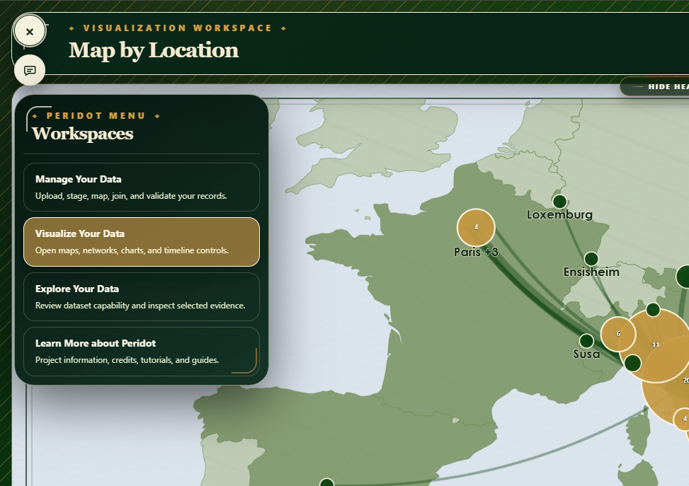

*Public workspace navigation, 2026-06-21: the hamburger menu provides access to Data, Visualizations, Explore, and Learn More.*

#### Load and map data

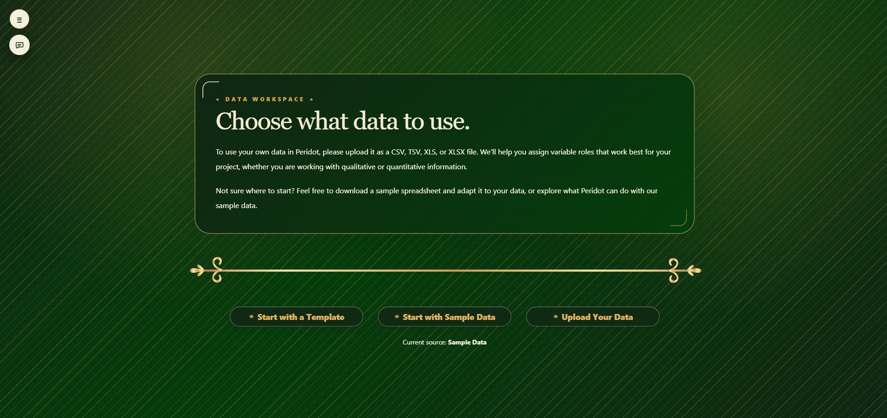

*Data workspace, 2026-06-21: the unified entry point for templates, sample data, and table or workbook upload.*

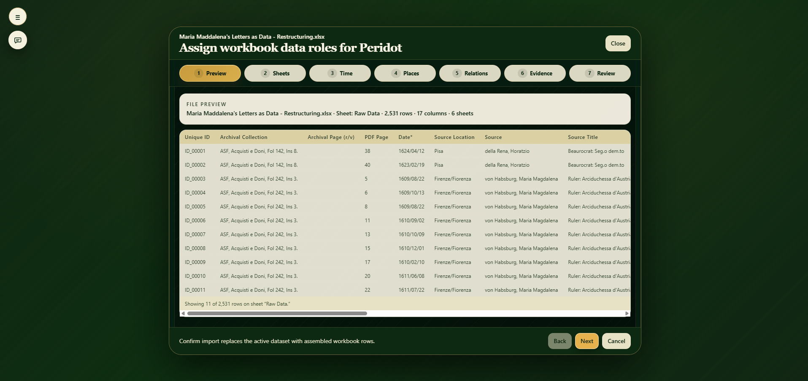

*Workbook role-mapping preview, 2026-06-21: users review a selected sheet before assigning time, place, relationship, evidence, and other data roles.*

#### Visualize and export

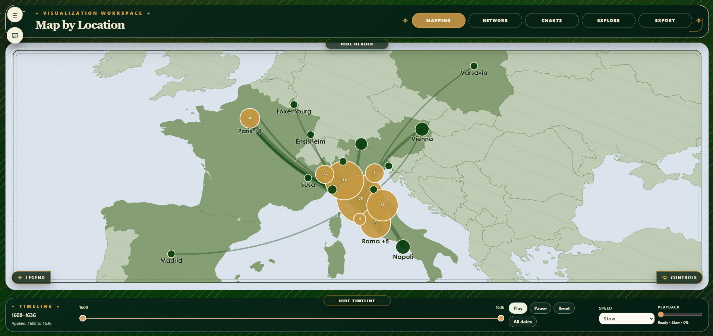

*Place Map workspace, 2026-06-21: geographic nodes, clustered places, routes, map controls, and the integrated timeline scrubber.*

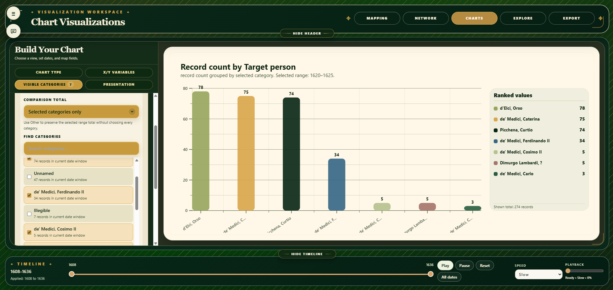

*Chart Visualizations workspace, 2026-06-21: a left-side chart builder pairs with a large chart canvas and ranked-value summary.*

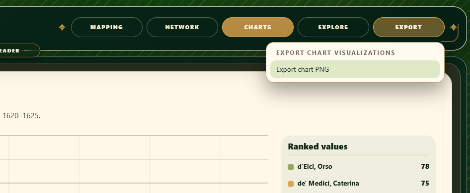

*Chart export control, 2026-06-21: Chart PNG export is available through the shared Visualizations header rather than a separate Export workspace.*

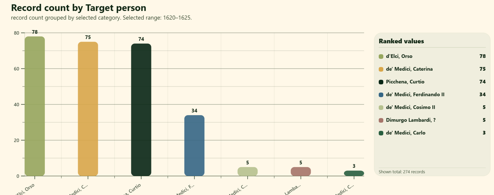

*Example chart PNG output, 2026-06-21: a researcher-facing bar chart with title, selected date range, labeled values, and ranked-value summary.*

<details>
<summary><strong>Additional Analytics examples — 2026-06-21</strong></summary>

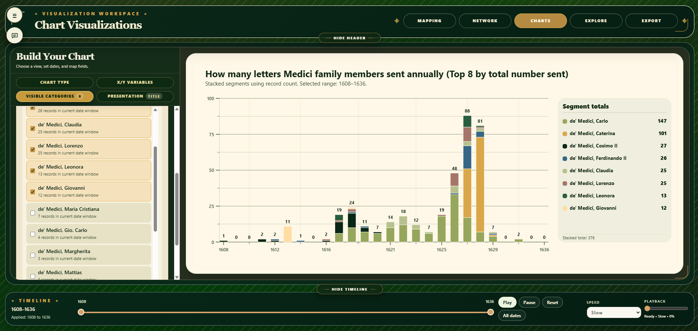

*Stacked bar chart example: annual correspondence volume segmented by selected categories.*

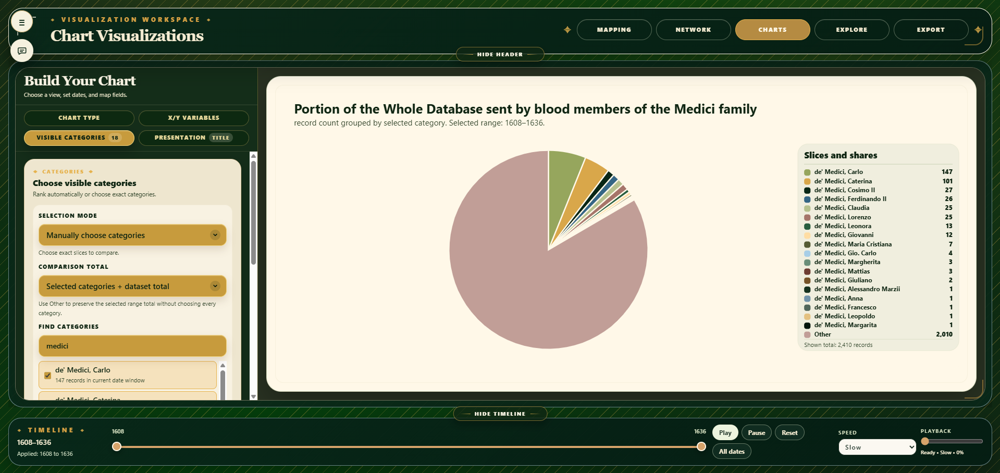

*Pie chart example: selected categories compared with the wider dataset total.*

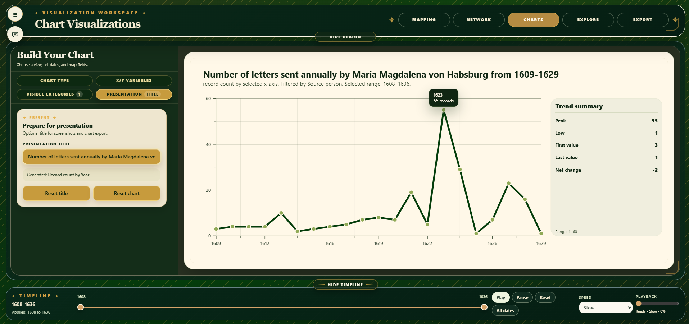

*Line chart example: a selected person’s annual correspondence trend over a defined historical period.*

</details>

#### Explore data

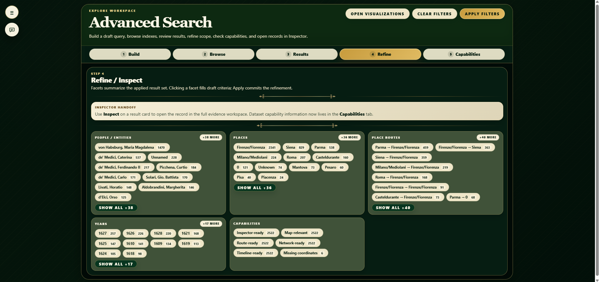

*Advanced Search Refine / Inspect tab, 2026-06-21: applied-result facets make people, places, routes, years, and capabilities available for further scoped refinement.*

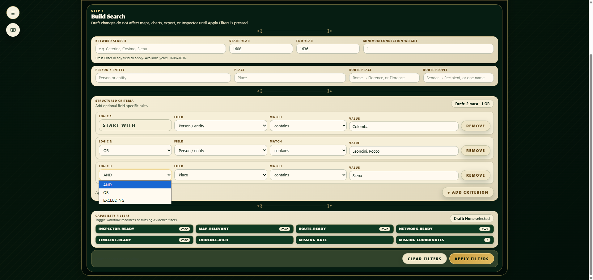

*Advanced Search structured criteria, 2026-06-21: up to five conditions can be combined through explicit AND, OR, and EXCLUDING connectors.*

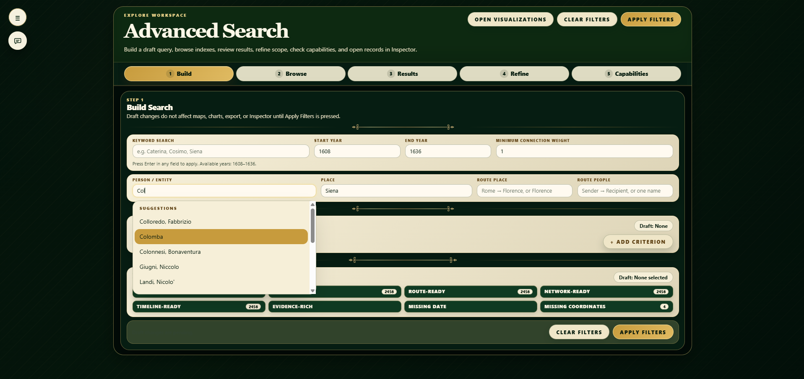

*Advanced Search predictive suggestions, 2026-06-21: person/entity fields provide a constrained, scrollable suggestion list rather than a long static dropdown.*

#### Inspect evidence

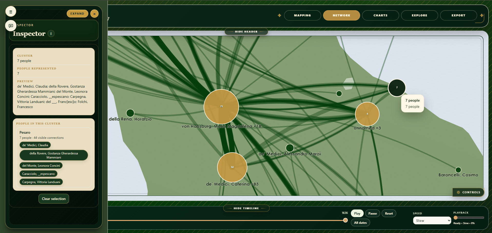

*Compact Inspector over Place Map, 2026-06-21: a selected geographic cluster summarizes represented people and exposes cluster members in context.*

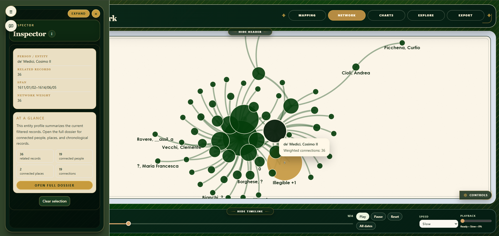

*Compact Inspector over Force-Directed Network, 2026-06-21: a selected person/entity retains network context while exposing connected-record and dossier actions.*

#### Learn and contribute


*Learn More information hub, 2026-06-21: creator context, open-source documentation links, AI-method disclosures, and future tutorial space.*


*Persistent in-app feedback form, 2026-06-21: users can submit questions, bug reports, issues, and feature suggestions directly to the project creator.*

### Brand and design-reference assets


*Peridot gilded logo asset used by the current Home workspace.*


*Transparent Peridot logo asset retained for adaptable placements.*

<details>
<summary><strong>Earlier Home layout design references — June 2026</strong></summary>


*Earlier Home layout concept used during the fixed-ratio title-card design process.*


*Annotated earlier Home layout concept documenting design decisions during development.*


*Licensed Adobe Stock filigree selected for current Home framing.*


*Licensed filigree reference set retained for design history and future ornamental work.*

</details>


---

## 5. Historical Interface Archive

The screenshots below document earlier Peridot interface states. They are retained as development records, including the earlier rail/side-panel-first workflow. They are **not** instructions for the active workspace-first navigation model.

<details>
<summary><strong>Open earlier interface records</strong></summary>

#### Earlier geographic view overview

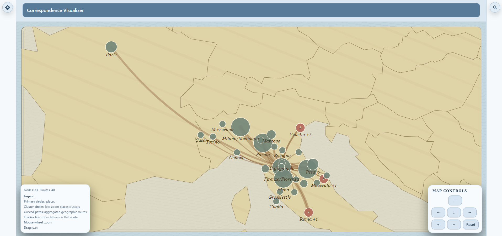

*Earlier geographic-view interface, retained as a pre-workspace-first development record.*

#### Earlier person view overview

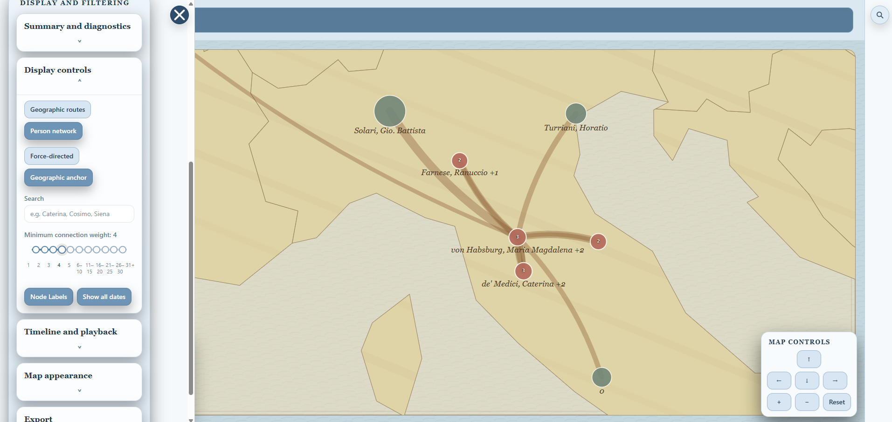

*Earlier person-view interface, retained to document the project’s prior person-network presentation.*

#### Earlier timeline and playback controls

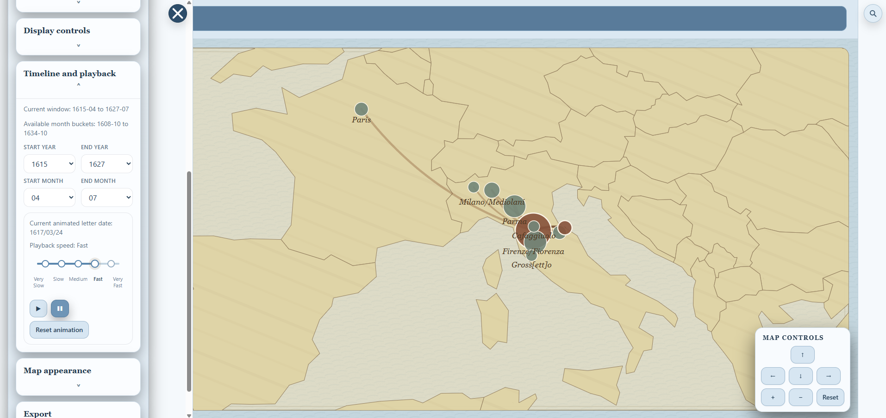

*Earlier standalone timeline/playback presentation, retained from before the current integrated Visualizations scrubber.*

#### Earlier Inspector detail view

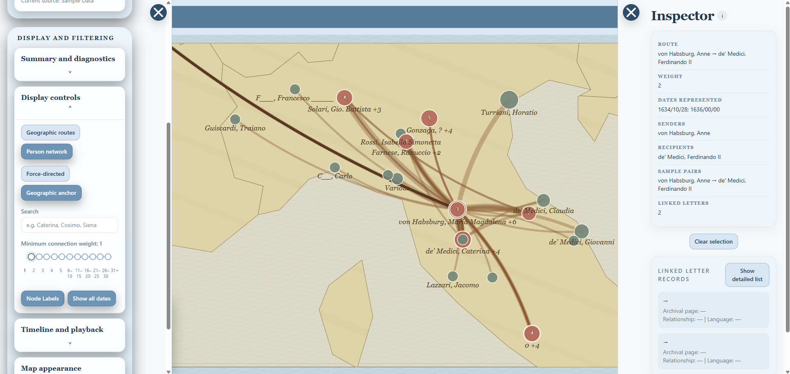

*Earlier Inspector presentation, retained from before the current compact-side-panel/full-dossier dual-mode model.*

#### Earlier geographic Inspector example

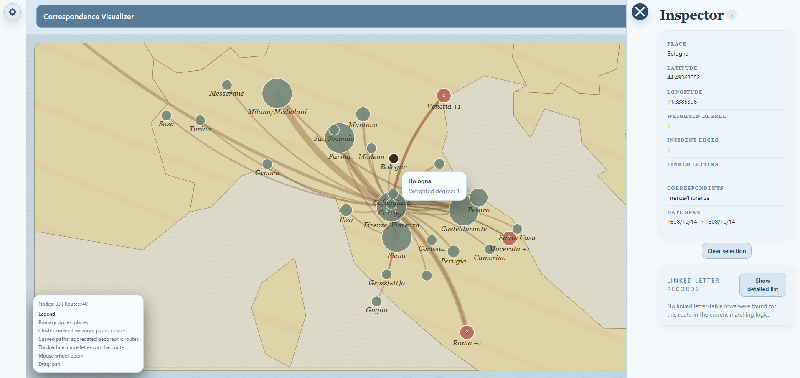

*Earlier geographic Inspector state, retained as a record of pre-dossier map interaction design.*

#### Earlier control panel overview

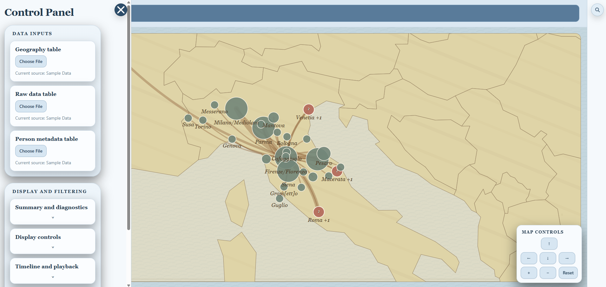

*Earlier persistent control-panel layout, retained from before the current workspace-first navigation and chart-builder model.*

#### Earlier additional control-panel state

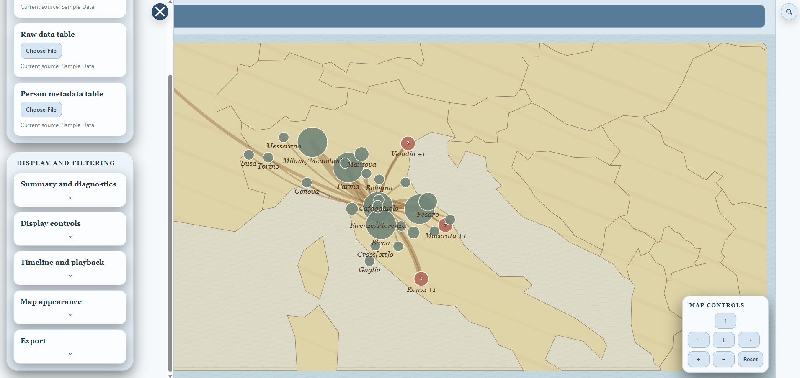

*Earlier control-panel variation, retained to document incremental interface development.*

#### Earlier modern-theme examples

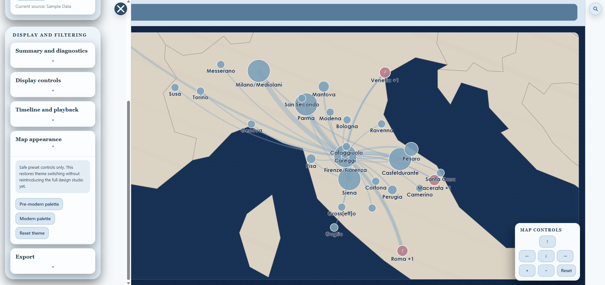

*Earlier Modern theme example, retained as a color-system development record rather than a current public-interface example.*

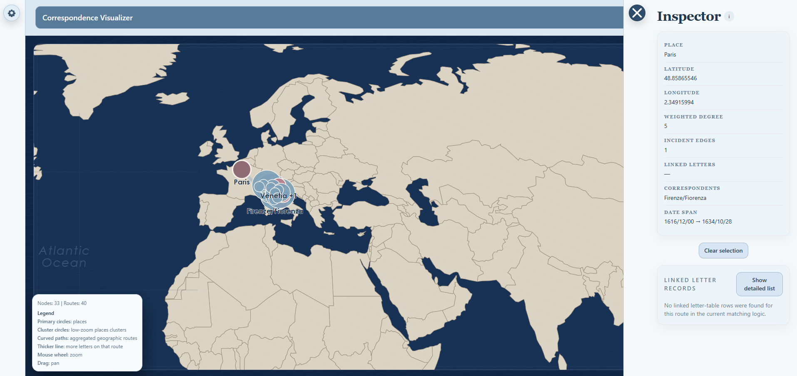

*Earlier Modern theme example, retained as a companion color-system development record.*

</details>


## 6. Install and Run Locally


### Prerequisites

You should have a recent version of:

- **Node.js**
- **npm**

### Install dependencies

```bash
npm install
```

### Start the development server

```bash
npm.cmd run dev
```

### Build for production

```bash
npm run build
```

### Preview the production build

```bash
npm run preview
```

### Repository location

```text
https://github.com/haleyrp1803/peridot-humanistic-data
```

---

### Technology overview

Peridot currently uses React 18, Vite, Tailwind CSS, D3 (`d3-geo` and `d3-force`), `topojson-client`, `world-atlas`, and SheetJS / `xlsx`. Active `main` uses an SVG-based map stage. MapLibre is not an active dependency of `main`; its later migrated-overlay work is archived rather than part of the current application direction.

## 7. Data-Input Guide

Peridot accepts ordinary CSV, TSV, XLSX, and XLS files through one generalized mapping workflow. It also provides a simple downloadable template and three downloadable sample datasets. The active public workflow no longer asks the user to choose Correspondence versus Genealogy before mapping.

The Data workspace provides:

- **Start with a Template**
- **Start with Sample Data**
- **Upload Your Data**
- active-source identification after a dataset has been selected
- **Edit mapped data** for researcher uploads
- **Edit sample mapping** for an active sample

No sample is loaded by default. First launch is a genuine no-data state until the user explicitly chooses or uploads a dataset.

### Simple correspondence-oriented template

The simple template remains useful for researchers whose data already resembles a directed correspondence record. Its public columns are:

```text
Archive
Collection
Page(s)
Date
Source_Name
Source_Title
Source_Location
Source_Latitude
Source_Longitude
Target_Name
Target_Title
Target_Location
Target_Latitude
Target_Longitude
Relationship
Topic
Language
Transcription
Notes
Link(s)
```

Using this template is optional. Arbitrary tables and workbooks can instead be mapped directly.

### Generalized mapping

Peridot treats the uploaded table as source evidence and asks the researcher to describe its structure. Depending on the file, mappings may include:

- one or more relationship participants, with integrated recurring-entity Identity controls when needed;
- record identity and recurring entity identity, including stable IDs and alternate compound recognition recipes;
- one or more dates and periods, each attributed to the record and/or selected participants;
- one or more places, including participant/record meanings, optional Identity, and coordinates for single-valued place cells;
- additional Evidence fields with optional cardinality and record/participant attribution;
- workbook sheet relationships joined by explicit unique IDs.

The same source field may participate in more than one mapping when that accurately represents the source. For example, one location column in a person-centered family table can be a child’s birthplace and, in the mother’s dossier, the place where she gave birth. Those are separate mapped assertions even when the literal place value is identical.

Identity rules are separate from display labels. A repeated entity can be recognized by one stable ID or by several equivalent identity components. This is particularly useful when one person appears in different roles: `Source + Source Title` and `Target + Target Title` may both map to the same conceptual Name + Title identity. Conversely, same-name people remain distinct when their stronger mapped identity differs.

Peridot uses a permissive **database-first** model. Useful records are not rejected merely because they lack coordinates, a parseable date, or a relationship. Mapping and validation determine which tools the available structure can safely support.

Peridot does **not** clean or standardize person names, place names, dates, topics, relationships, languages, titles, or other user-entered values. Charts, filters, labels, and entity grouping use the uploaded/mapped values and declared identity rules. Researchers who want standardized vocabularies should prepare them intentionally rather than relying on silent application cleanup.

### Time and partial historical dates

Temporal parsing is conservative and humanities-aware. Peridot preserves original temporal text while deriving machine-usable structure for ordinary dates, year/month/day precision, approximate forms, mixed-precision ranges, open-ended periods, and partial dates such as `1607/00/02`, where zero represents an unknown component rather than a literal zero. Structurally inconsistent ranges are preserved and flagged rather than silently reversed. Competing date possibilities remain preserved for review rather than being collapsed into false certainty.

Mapped Time is repeatable. Users can name each Date or Period/range in ordinary language; use one source field or separate year/month/day fields; reuse fields across assertions; and preserve related researcher-note columns without treating those notes as visualization rules.

### Workbook / Excel import

For `.xlsx` and `.xls` files, Peridot supports workbook-aware mapping:

- review workbook sheets;
- choose a primary record sheet;
- choose a primary unique-ID column;
- add related-sheet joins;
- choose the primary and joined ID field for each join;
- map Relations, Identity, Time, Places, and Evidence from sheet-qualified fields;
- review the final interpretation before import.

Header names for joined IDs do not have to match. The user-selected join is authoritative. Row order is not used as the primary join strategy. Duplicate IDs that would make the join unsafe are blocked or surfaced rather than silently creating repeated assembled records.

### First-class sample datasets

Peridot currently ships:

```text
correspondence_network_sample.xlsx
family_tree_sample.csv
cardinals_1600_1640_sample.xlsx
```

These are ordinary project files, not hidden application fixtures. Users can download them, inspect their mappings, change the active interpretation, and reuse the downloaded files as starting points for their own work.

The canonical sample mapping remains preserved even while the active sample is edited. **Reset to sample mapping** returns the editor to the shipped interpretation.

### Multiple values and delimiters

Peridot supports researcher-declared multiple values on suitable mapped fields. Cardinality is configured per mapped item rather than once for the entire file: choose one value versus several values, then supply the delimiter when needed. Peridot preserves the original source cell and does not infer delimiters automatically. Structured component dates and separate period endpoints remain structured units rather than parallel arrays, and multi-valued place cells cannot reuse one row-level coordinate pair.

### Typical workflow

1. Open Peridot; no dataset is active yet.
2. Choose a sample, download the template, or upload your own CSV/TSV/XLSX/XLS file.
3. Review Preview and workbook Sheets if applicable.
4. Map Relations and configure stronger participant Identity only where the default displayed-name rule is insufficient.
5. Add Time and Places with the appropriate record/participant attribution and per-field cardinality where relevant.
6. Include or ignore Evidence fields; declare their cardinality and subjects where useful.
7. Review the full mapping and warnings.
8. Confirm import.
9. Reopen **Edit mapped data** later if the interpretation needs revision.
10. Open Visualizations, Advanced Search, Inspector, and Export as the data supports them.

### Advanced Search workflow

Advanced Search defines the active filtered dataset:

```text
loaded data
→ applied/filtered data
→ visualization / inspection / analytics / export
```

Under that model:

- **Data** defines what is loaded.
- **Advanced Search** defines the applied/filtered research scope; Browse intentionally indexes the full loaded dataset.
- **Visualizations** defines how that scope is displayed.
- **Timeline** controls chronological range and playback visibility within Visualizations.
- **Inspector** is selection-driven, but entity/place dossiers use the stable applied/filtered linked-record scope rather than shrinking as playback advances.
- **Analytics** uses the Search/Timeline/playback scope for dated records while keeping genuinely undated records available by default; its local **Exclude undated records?** control can remove them explicitly.
- **Export** identifies the relevant visible or charted output and records committed structured/capability Search filters in provenance where applicable.

These scope distinctions were audited and synchronized through `656010d`; do not treat applied/filtered, playback-visible, selected, charted, and exported data as interchangeable.

## 8. Known User-Facing Limitations

Peridot is an active research prototype. It can preserve and expose useful incomplete records, but not every dataset supports every visualization. Network views require usable mapped entity relationships; map views require usable location information; Timeline and chart behavior depend on available temporal and analytic fields.

Generalized Relations, Identity, Time, Places, Evidence, Inspector participant attribution, and the principal Search place/Evidence/Results paths are now authoritative across the current import/runtime path. Compatibility projections still exist for older consumers and should be retired only after a repository-wide audit proves that their behavior has been replaced without loss.

The generalized Network path is the next major architecture project. Follow-up work includes geographic relationship/event scoping, transparent person-to-place anchoring, generalized playback highlighting, and a later presentation pass for Force-Directed viewport fitting, arrowhead placement, node/cluster sizing, and possible researcher-adjustable scaling controls.

One bounded Search limitation remains: **Any record text** does not yet guarantee indexing of every generalized mapped semantic value. Explicit fielded criteria such as Place and canonical Evidence search already use the generalized structures.

Phase 3 of the universal data work—the generalized Chart Builder—also remains deferred. The intended direction is to build charts from saved/generalized variables through structured, human-readable controls rather than unrestricted natural-language prompting.

The existing guided tutorial implementation remains in source, but its Home entry is currently disabled while tutorial content and polish are revisited. The Home now exposes a smaller static **Tutorial** placeholder beneath the two primary data-entry actions; hover/focus reads **“Tutorial coming soon.”** The larger Home/Data integration, tutorial attention choreography, placement, typography, accessibility, and full UX walkthrough remain later bounded work.

MapLibre work is archived and should not be treated as part of current `main`. For active technical caveats, regression expectations, and compatibility paths, see the Maintainer’s Guide.

## 9. Documentation and Project References

- [Maintainer’s Guide](MAINTAINERS_GUIDE.md) — current architecture, module ownership, contracts, fragile zones, and regression matrices.
- [Project Workflow Charter](PROJECT_WORKFLOW_CHARTER.md) — mandatory source-of-truth, bounded-pass, delivery, recovery, and commit process.
- [Changelog](CHANGELOG.md) — current checkpoint, milestone history, deferred work, and complete commit chronology.
- [Core Documentation Governance Protocol](PERIDOT_CORE_DOCUMENTATION_GOVERNANCE_PROTOCOL.md) — rules for preserving and maintaining the core documents.
- [Core Documentation Restructuring Plan](../planning_documents/PERIDOT_CORE_DOCUMENTATION_RESTRUCTURING_PLAN.md) — section-mapping plan for this documentation architecture.
- [Repository](https://github.com/haleyrp1803/peridot-humanistic-data) — current public source repository.

## 10. Author, License, and Attribution


### Author / Maintainer

Repository owner: **Haley R. P.**

### License

Add the project’s chosen license here if and when one is finalized.
